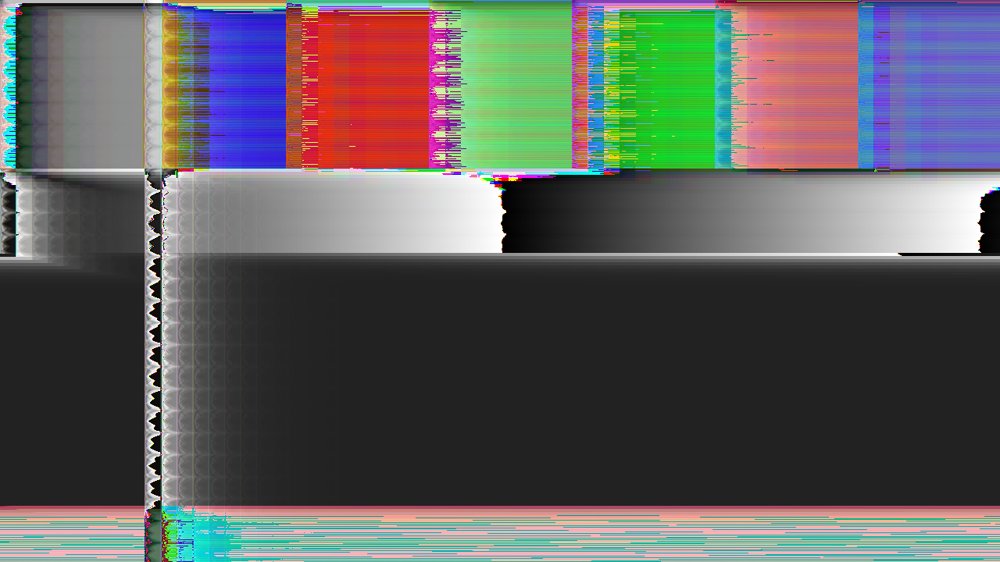

# databend

> **AI-assisted project.** This codebase was created with [Claude](https://claude.com/claude-code)
> (Anthropic), directed and reviewed by a human author. The effects are not
> asserted but measured: an offline harness drives the real plugin class in a
> headless GL context and reads each claim back out of the picture it made —
> an echo of a line and k samples lands one line down and k across, and moves
> with the row stride when the file has padding, with the whole picture matching
> the closed form to **zero** error; the nth echo sits at n·(k, 1) with amplitude
> m gⁿ; in an interleaved file a delay ≡ 1 (mod 3) puts red's echo in green,
> green's in blue and blue's in the next pixel's red; the flanger's ghost on every
> line sits where the LFO says at that line's stream time; the phaser keeps a
> noise line's energy to 4e-8 of it and matches a serial double run of the
> cascade within a bound it proves; an 8-bit file wraps past full scale, a
> 16-bit one wraps, a float one clips, exactly — with seven negative controls
> that prove each check can fail. It has **never been loaded into Resolume**. It
> is loaded by [oxbow](https://github.com/stoatworks-labs/oxbow), which is a real
> FFGL host and is not Resolume. See [Status](#status).

The raster as a PCM stream through audio effects, as an FFGL effect for
[Resolume](https://resolume.com) Arena and Avenue.



<sub>One frame, rendered by `dbtest`, the offline harness — not captured from
Resolume. Interleaved, 8-bit, Wrap; an echo four lines and 61 samples down at
0.6 feedback. Every colour in it is a red, green or blue sample that came back
in the wrong slot.</sub>

## The one idea

Databending is opening a picture in an audio editor and running audio effects
on it. The editor does not see a picture. It sees **one long stream of samples
in the order the file lays them out** — row by row, one plane after another or
R, G, B per pixel, with a row stride that may carry padding — and a delay-line
effect on that stream does not know where the lines are.

Model that stream exactly, and run real delay-line effects on it. Everything
falls out of the layout; nothing is drawn:

- **An echo** of D = k·L + m samples (L the line length in samples) comes back k
  lines down and m samples across. With feedback the echoes march down the
  picture on a slant, each one m gᵏ as bright as the last.
- **A flanger** is a delay swept by an LFO in stream time — and stream time *is*
  the scan, so the ghost's offset changes line by line: a comb across the
  scanlines.
- **A phaser** is a cascade of all-pass stages whose coefficient the LFO sweeps.
  An all-pass passes every frequency at unity gain and shifts its phase, so
  smooth content arrives late and edges arrive on time: the picture smears
  rightwards with ringing and keeps its energy.
- **A pitch shifter** resamples the scan in grains with crossfades: inside a
  grain the line is stretched, at the seam it repeats or skips.

**The file layout is part of the mechanism.** In an interleaved RGB stream a
delay that is not a multiple of three lands one channel's samples in another's
slot, so the echo comes back in the wrong colour — and every effect rotates
hue, because the hue lives at the stream's period-3 frequency. In a planar
stream it does not, but a delay past a plane's start reads the previous plane:
the first lines of green carry echoes of the last lines of red. And the sample
format decides what happens past full scale: an 8-bit unsigned file **wraps**
(the harsh databend look) or clips, a float file clips; an unsigned file's
silence is black, a signed one's is mid-grey.

## Controls

| Group | | |
| --- | --- | --- |
| **Stream** | Layout | Planar (all of R, then G, then B) or Interleaved (R, G, B per pixel) |
| | Line Padding | extra samples on every line, 0 to 255: the row stride, which sets the slant |
| | Direction | Rows or Columns: what a line is |
| | Format | 8-bit unsigned (zero at black), 16-bit signed or Float (zero at mid-grey) |
| | Overflow | Wrap or Clip past full scale, for the integer formats; a float file clips |
| **Echo** | Echo On | |
| | Delay Lines | 0 to 32 lines of the stream |
| | Delay Samples | 0 to 4095 samples on top |
| | Feedback | 0 to 7/8; each echo is this much of the last |
| | Echo Mix | how much of the echo train is added |
| **Flanger** | Flanger On | |
| | Base Delay | 0 to 64 samples |
| | Depth | how far the LFO sweeps the delay, 0 to 64 samples |
| | Rate | 0.05 to 20 Hz in stream time, at the file's nominal 44.1 kHz |
| | Flanger Mix | a crossfade; the comb is deepest at half |
| **Phaser** | Phaser On | |
| | Stages | 2 to 12 all-pass sections |
| | Phaser Rate | the sweep, 0.05 to 20 Hz in stream time |
| | Phaser Depth | how far the pole sweeps down from 0.9 |
| | Phaser Mix | a crossfade; at 1 the picture is pure all-pass and keeps its energy |
| **Pitch** | Pitch On | |
| | Ratio | half to double |
| | Grain | 64 to 4096 samples |
| | Pitch Mix | |
| **Output** | Mix | |

## Status

**v0.1.0, 2026-09-24.** Built from the fleet's templates in one session. What
`tools/verify.sh` establishes on this Mac (Apple M4 Max, macOS 26.4), on a
fresh universal build, at **320×180 and 1280×720**:

| check | what it establishes |
| --- | --- |
| `--echo` | a delay of one line + 7 samples ghosts at (+1, +7); the same delay in samples (Lp + 7) lands there too, and with 5 samples of padding at (+1, +2), as the stride predicts; the whole picture matches the closed form with **worst 0** against a 9.7e-6 tolerance, four cases |
| `--feedback` | 14 echoes at (j, 7j) with amplitude m gʲ down to one code, worst 5.7e-8 of signal; the plugin's 14 taps are the count one float-file code predicts |
| `--interleave` | D = 4 puts R's echo in G one pixel on, G's in B, B's in the next pixel's R; D = 3 keeps every colour; D = L + 1 lands a line down in G; whole-picture **worst 0**, six cases |
| `--flanger` | on 179 of 180 and 720 of 720 lines the ghost's offset is the LFO's value at that line's stream time, 16.1 to 48.0 samples across the picture; worst 0.0014 of 0.0015 samples (the LFO's own slope over one sample) |
| `--allpass` | with 4 and 12 stages sweeping 0..0.9, a noise picture's energy is kept to 1e-5 of 226 and 4e-4 of 3596; every one of 172,800 / 2,764,800 samples matches the serial double cascade to 1.6e-7 / 7e-7 against a bound of 4e-5; the plugin's window (283, 660) is the stated one; at a quarter of that window the error is 580 tolerances |
| `--wrap` | 1.4375 of full scale exports as 111/255 (8-bit Wrap), 1 (8-bit Clip), 0.21875 (16-bit Wrap), 32767/32768 (16-bit Clip), 1 (float); 0.6289 quantises exactly; worst 3e-8 |
| `--pitch` | bars of period 16 come out with period 32 at Ratio 1/2 and 8 at Ratio 2 (autocorrelation ≥ 0.88 of R(0) at the period, ≤ −0.94 at the half period), 16 bypassed |
| `--negative` | seven perturbed plugins — the stride ignoring padding, a flat echo gain, an interleaved stream laid out planar, a frozen LFO, the window cut to a quarter, an integer format that never wraps, a pitch shifter reading at 1/r — each **fails** its check |
| mutation | one character of the shipped echo shader (`n - k * Delay` → `n + k * Delay`) failed 17 of 25 checks at both rasters, then reverted |
| `--laws`, `--names`, `--window` | every control law at 21 points; the dyadic promises; 29 names unique and within 16 characters, the host reads `SW Databend` / `DB01` / effect; the phaser's window is 207 at the defaults and at most 682 over the whole control range (limit 1024) |
| `tools/sweep.py` | all **25** controls measurably change the picture |
| shaders | all 8, as the plugin compiles them, through `glslc` |
| `--pipe` | 2.5 frames in, exactly 2 out; an unknown cue refused (2); a failed render and a closed stdout (`\| head -c 1`) each exit 1 |
| the bundle | universal (`x86_64 arm64`), exports `plugMain`, ad-hoc signs; `oxbow` reports `SW Databend` / `DB01` / `effect` and renders 120 frames through `plugMain` |

Render cost at the defaults, best of three runs of 60 frames after a warm-up,
`glFinish` both sides, on a GPU shared with other builds: **2.9 ms** at 720p,
**5.8 ms** at 1080p, **18.7 ms** at 4K; with the pitch shifter on as well, 2.9 /
5.0 / 21.9. The phaser's restart window is where the time goes — 207 samples
re-run once per 16-sample chunk at the defaults, from a bound that is
rigorous and about twice as long as the error needs — so 4K is not real time
with the phaser on. macOS figures only.

The defaults were judged on twelve of Resolume's bundled demo clips through
the harness's `--pipe`: with Wrap, every phaser overshoot past full scale
wrapped and eight of twelve clips flooded; with Interleaved every clip went
pink, because every effect rotates the hue of an interleaved stream. Both are
the mechanism and both are one click away; the defaults are Planar and Clip.

### Not established

It has **never been loaded into Resolume**, on either platform. Everything
above was compiled, rendered and measured offline against the real plugin class
in a headless CGL context, plus an `oxbow` load. Footage has only been seen
through the harness's `--pipe`. No Windows build has run. How 25 controls read
in Arena's inspector is untested. **No phaser feedback**: a swept-coefficient
loop has no bound of the kind the window rests on, and the exact alternative
is a serial pass over millions of samples (`AGENTS.md`). No OpenFX port, no
user guide.

## Browser demo

[databend-demo.stoatworks-labs.com](https://databend-demo.stoatworks-labs.com/) runs
the plugin's own seven passes in WebGL2 on generated clips, with every control the
plugin declares. The ten shader bodies are copied unedited and
`demo/tools/check_shaders.py` (run by `tools/verify.sh`) fails if a character drifts;
the CPU half — the control laws in `Controls.cpp`, the echo's tap count and the
phaser's window bound in `Model.h`, the per-frame arithmetic in `Databend.cpp` — is
a hand port to JavaScript, and nothing checks a port but a reader (the port does
reproduce `dbtest --window`'s whole table and the 207-sample default). The four
integer controls are dropdowns there, because the kit has no integer type. On the
same 960×540 colour-bars frame the page and `dbtest --pipe` agree on every pixel
exactly with the echo, the export and the layouts (Planar, Interleaved + Wrap,
16-bit signed + Columns + 5 samples of padding) and within 1/255 with the pitch
shifter on — measured once, 2026-09-24, SwiftShader against Metal GL, with the
flanger and phaser off because their LFO phase rides on a frame counter the two
do not share. The page says on its face what it is not. `demo/vendor/` is the shared kit from
`stoatworks-backend/resolume-demo`; a push to main redeploys the Worker.

## Build

Needs CMake 3.15+, a C++17 compiler, and the FFGL SDK submodule.

```bash
git clone --recursive https://github.com/stoatworks-labs/databend
cd databend
cmake -B build -DCMAKE_BUILD_TYPE=Release
cmake --build build --parallel
cmake --install build     # into ~/Documents/Resolume Arena/Extra Effects
```

macOS builds are universal (Apple Silicon + Intel) by default; add
`-DCMAKE_OSX_ARCHITECTURES=arm64` for a faster dev build. Windows needs GLEW via vcpkg.

## Building and testing

The offline harness renders the real plugin class headlessly:

```bash
./build/dbtest --out /tmp/frame.png --size 1920x1080   # the moving card
./build/dbtest --list                                  # every control, kind and default
./build/dbtest --echo --feedback --interleave           # the echo, measured
./build/dbtest --flanger --allpass --wrap --pitch       # the rest, measured
./build/dbtest --negative                              # and the checks can fail
./build/dbtest --offline                               # what needs no GL (CI)
./build/dbtest --bench                                 # 720p, 1080p and 4K
python3 tools/sweep.py                                 # no control is silently dead
python3 demo/tools/check_shaders.py                    # the browser demo's shaders are the plugin's
tools/verify.sh                                        # all of it, on a fresh universal build
```

Every check takes `--size`; run it at 320×180 as well as the raster you care about.
Footage goes through the real shaders with `--pipe`, in the fleet's frame format:

```bash
ffmpeg -i in.mov -f rawvideo -pix_fmt rgba - \
  | ./build/dbtest --pipe --size 1920x1080 --script cues.txt \
  | ffmpeg -f rawvideo -pix_fmt rgba -s 1920x1080 -r 50 -i - out.mov
```

See [`CLAUDE.md`](CLAUDE.md) for the full command reference and
[`AGENTS.md`](AGENTS.md) for the model and the traps.

<!-- attributions:start -->
This project is built on other people's work — see [ATTRIBUTIONS.md](ATTRIBUTIONS.md).
<!-- attributions:end -->

## Licence

MIT — see [LICENSE](LICENSE).
